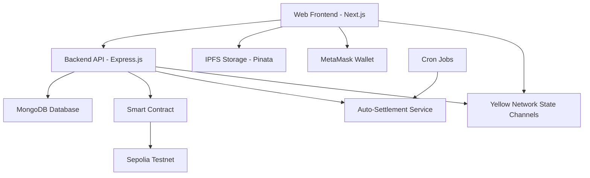

# 🎭 Laugh Odds - Where Memes Meet Web3 Economics

[](https://youtu.be/RuDiHXnxoms?feature=shared)

**The first web3 platform bringing financial value to meme creation and curation. Create, vote, and earn from the internet's favorite content while building a true community around humor.**

> **🚀 Available as both Web App and Telegram Mini App!**

## 🌐 Live Demo

<!-- **🔗 [Visit Laugh Odds]()** -->

Experience the full platform live at our deployed web application!

## 🎬 Demo Video

<!-- [](https://youtu.be/RuDiHXnxoms?feature=shared) -->

_Click to watch the full demo on YouTube_

## 📱 Platform Availability

### 🌐 Web Application

<!-- - **URL**: [https://viral-forge-frontend.vercel.app/](https://viral-forge-frontend.vercel.app/) -->

- **Features**: Full desktop and mobile web experience
- **Wallet**: MetaMask integration
- **Responsive**: Works on all screen sizes

_Experience the same powerful meme creation and voting platform in both formats!_

## 📋 Table of Contents

- [🌟 Features](#-features)
- [🏗️ Architecture](#️-architecture)
- [🚀 Quick Start](#-quick-start)
- [⚙️ Setup Instructions](#️-setup-instructions)
- [🔧 Configuration](#-configuration)
- [📁 Project Structure](#-project-structure)
- [🎯 How It Works](#-how-it-works)
- [🔗 Smart Contract](#-smart-contract)
- [🛠️ Tech Stack](#️-tech-stack)
- [🎮 Usage Guide](#-usage-guide)
- [🔧 Development](#-development)

## 🌟 Features

### 🎨 Template Creation Studio

- Upload and create original meme templates
- Advanced meme editor with draggable text
- Earn royalties from template usage

### 🗳️ Humor Prediction Markets

- Simple swipe interface (Right = Funny, Left = Lame)
- Stake 0.0001 ytest.usd per vote via Yellow Network state channels
- Democratic humor validation
- 6-hour settlement period

### 💰 Decentralized Rewards

- 95% to winning voters, 5% to creators
- Automatic settlement after 6 hours
- Fair reward distribution based on contribution
- Real-time earnings tracking

### 👥 Three-Pillar Ecosystem

- **Template Creators**: The visionaries who spot emerging meme potential
- **Meme Creators**: The storytellers who transform templates into hilarious content
- **Meme Consumers**: The validators who discover, curate, and earn for accurate taste predictions

### ⚡ Gasless Voting via Yellow Network

- Votes are off-chain state channel transfers — no gas fees
- Instant finality via Yellow Network's Clearnode
- Automatic faucet top-up for new users

## 🏗️ Architecture



## 🚀 Quick Start

### Prerequisites

- Node.js 16+
- pnpm (recommended) or npm
- MetaMask wallet
- MongoDB database

### 1-Minute Setup

Clone the repository:

```bash
git clone https://github.com/Laugh-Odds/Laugh-Odds
cd Laugh-Odds
```

Install dependencies for both client and server:

```bash
cd client && pnpm install
cd ../server && pnpm install
```

Set up environment variables (see Configuration section):

```bash
cp .env.example .env
```

Start development servers in two terminals:

Terminal 1 - Server:

```bash
cd server && pnpm dev
```

Terminal 2 - Client:

```bash
cd client && pnpm dev
```

Visit `http://localhost:3000` to start creating memes! 🎉

## ⚙️ Setup Instructions

### Client Setup

Navigate to client directory:

```bash
cd client
```

Install dependencies:

```bash
pnpm install
```

Create environment file:

```bash
cp .env.example .env
```

Start development server:

```bash
pnpm dev
```

The client will be available at `http://localhost:3000`

### Server Setup

Navigate to server directory:

```bash
cd server
```

Install dependencies:

```bash
pnpm install
```

Create environment file:

```bash
cp .env.example .env
```

Start development server:

```bash
pnpm dev
```

The server will be available at `http://localhost:5000`

## 🔧 Configuration

### Server Environment Variables

Create `server/.env` with the following variables:

```env
# Database Configuration
MONGODB_URI="your_mongodb_connection_string"

# Blockchain Configuration
SEPOLIA_RPC_URL="https://1rpc.io/sepolia"
PRIVATE_KEY="your_deployer_private_key"

# Yellow Network
YELLOW_CLEARNODE_WS_URL="wss://clearnet-sandbox.yellow.com/ws"
YELLOW_SESSION_KEY="your_yellow_session_key"

# Server Configuration
PORT=5000
```

### Client Environment Variables

Create `client/.env` with the following variables:

```env
# IPFS Storage
NEXT_PUBLIC_LIGHTHOPSE_GATEWAY="your_lighthouse_api_key"

# Yellow Network
NEXT_PUBLIC_CLEARNODE_WS_URL="wss://clearnet-sandbox.yellow.com/ws"
NEXT_PUBLIC_YELLOW_CUSTODY="0x019B65A265EB3363822f2752141b3dF16131b262"
NEXT_PUBLIC_YELLOW_ADJUDICATOR="0x7c7ccbc98469190849BCC6c926307794fDfB11F2"
NEXT_PUBLIC_SERVER_YELLOW_ADDRESS="your_server_yellow_address"

# Environment
NEXT_PUBLIC_PROD=False
```

### Contract Address Configuration

If you deploy a new smart contract, update the contract address in these files:

Client Configuration:

```javascript
// client/lib/ethers.ts
export const DEPLOYED_CONTRACT = "YOUR_NEW_CONTRACT_ADDRESS";
```

Server Configuration:

```javascript
// server/services/settlementService.js (line 12)
this.contractAddress = "YOUR_NEW_CONTRACT_ADDRESS";
```

**Current Contract Address:** `0x4c7Bad39Fc980701043a3b03051Cd64835d5e2aA`

## 📁 Project Structure

```
Laugh-Odds/
├── client/                     # Frontend Next.js application
│   ├── app/                   # App router pages
│   │   ├── app/              # Main application pages
│   │   │   ├── memes/       # Meme-related pages
│   │   │   │   ├── create/  # Meme creation
│   │   │   │   ├── settlements/ # User settlements
│   │   │   │   └── templates/ # Template viewing
│   │   │   └── layout.tsx   # App layout
│   │   ├── globals.css      # Global styles
│   │   ├── layout.tsx       # Root layout
│   │   └── page.tsx         # Landing page
│   ├── components/           # Reusable React components
│   │   ├── meme-creator/    # Meme creation components
│   │   ├── Landing/         # Landing page components
│   │   └── ui/              # UI components
│   ├── context/             # React context providers
│   │   └── YellowNetworkContext.tsx # Yellow Network state
│   ├── hooks/               # Custom React hooks
│   │   └── useYellowChannel.ts # Yellow Network voting hook
│   ├── lib/                 # Utility libraries
│   └── config/              # Configuration files
│
└── server/                   # Backend Express.js application
    ├── models/              # Database models
    │   └── Settlement.js    # Settlement tracking
    ├── services/            # Business logic services
    │   ├── settlementService.js    # Auto-settlement service
    │   └── yellowNetworkService.js # Yellow Network rewards
    ├── server.js            # Main server file
    └── FunnyOrFud.json      # Smart contract ABI
```

## 🎯 How It Works

### 1. Template Creation 🎨

- Users upload images or photos to create meme templates
- Templates are stored on IPFS for decentralized access
- Smart contract creates a prediction market for each template

### 2. Meme Creation ✍️

- Users select templates and add custom text
- Advanced editor with draggable, resizable text boxes
- Final memes are stored on IPFS and linked to templates

### 3. Voting & Prediction 🗳️

- Simple swipe interface: Right = Funny, Left = Lame
- Each vote costs 0.0001 ytest.usd via Yellow Network (gasless)
- 6-hour voting period for fair settlement

### 4. Automatic Settlement ⚡

- Cron job checks for expired markets every 5 minutes
- Rewards distributed via Yellow Network state channel transfers
- 95% to winning voters, 5% to template creators

### 5. Settlement Tracking 📊

- Database tracks all user votes and settlements
- Users can view their betting history and earnings
- Real-time settlement status updates

## 🔗 Smart Contract

### Contract Details

- **Network**: Sepolia Testnet
- **Address**: `0x4c7Bad39Fc980701043a3b03051Cd64835d5e2aA`
- **Explorer**: [View on Sepolia Etherscan](https://sepolia.etherscan.io/address/0x4c7Bad39Fc980701043a3b03051Cd64835d5e2aA)

### Key Functions

```solidity
// Create a new meme template market
function createMarket(string memory metadata) external

// Create a meme using existing template
function createMeme(address creator, string memory cid, uint256 templateId) external
```

### Contract Features

- **Market Duration**: 6 hours
- **Creator Reward**: 5% of total pool
- **Voter Rewards**: 95% distributed among winners
- **Payments**: Off-chain via Yellow Network (gasless)

## 🛠️ Tech Stack

### Frontend

- **Framework**: Next.js 14 (App Router)
- **Styling**: Tailwind CSS
- **UI Components**: Custom components with Framer Motion
- **Web3**: Wagmi + Viem
- **Wallet**: MetaMask integration
- **Storage**: IPFS via Pinata
- **State Management**: React hooks

### Backend

- **Runtime**: Node.js
- **Framework**: Express.js
- **Database**: MongoDB with Mongoose
- **Blockchain**: ethers.js
- **Job Scheduling**: node-cron

### Blockchain & Payments

- **Smart Contract Network**: Sepolia Testnet
- **Smart Contract**: Solidity
- **Wallet Integration**: MetaMask
- **Vote Payments**: Yellow Network state channels (gasless, off-chain)
- **Vote Token**: ytest.usd

## 🎮 Usage Guide

### For Template Creators

1. Connect your MetaMask wallet
2. Navigate to "Create" section
3. Upload an image or take a photo
4. Wait for IPFS upload and smart contract deployment
5. Earn 5% from every vote on your template!

### For Meme Creators

1. Browse existing templates
2. Select a template you like
3. Add custom text with the drag-and-drop editor
4. Publish your meme to the template's market
5. Share your creation on social media

### For Voters/Curators

1. Browse meme templates and their content
2. Swipe right (👍) for funny memes
3. Swipe left (👎) for lame memes
4. Pay 0.0001 ytest.usd per vote (gasless via Yellow Network)
5. Win rewards if you're in the majority after 6 hours!

### Settlement Tracking

1. Visit the "Settlements" page
2. View your voting history
3. See win/loss status for each bet
4. Track your total earnings
5. View settlement transaction details

## 🔧 Development

### Adding New Features

Frontend Components:

```bash
cd client/components
# Add your new component
```

Backend Routes:

```bash
cd server
# Add routes to server.js
```

Database Models:

```bash
cd server/models
# Add new Mongoose models
```

### Testing

Test frontend:

```bash
cd client && pnpm build
```

Test backend:

```bash
cd server && pnpm start
```

---

## 🤝 Contributing

We welcome contributions! Please feel free to submit a Pull Request.

## 📄 License

This project is licensed under the MIT License.

## 🙋‍♂️ Support

For support, please open an issue on GitHub or contact us through our social channels.

---

_Built with ❤️ for the meme community_
